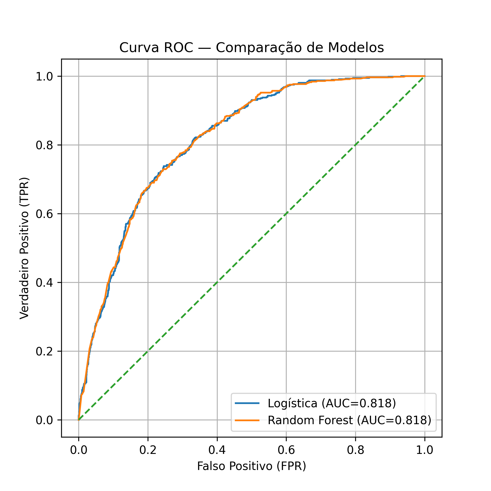

# TelecomX Predição de cancelamentos

## Descrição do Projeto

Este projeto visa prever a evasão (cancelamentos) de clientes de uma operadora de telecomunicações a partir de dados de uso e perfil. Dois modelos foram comparados: **Regressão Logística** e **Random Forest**, usando técnicas de pré-processamento, balanceamento de classes e avaliação completa de métricas.

## Estrutura do Repositório

```
TelecomX_Regressao_machine.ipynb   # Notebook principal com todo o fluxo
README.md                          # Este arquivo de documentação
dados_normalizados.csv             # Base de dados
```

## Pré-requisitos e Instalação

1. **Python 3.8+**
2. **Bibliotecas**
  ```
  import pandas as pd
  import numpy as np
  import matplotlib.pyplot as plt
  import seaborn as sns

  from sklearn.preprocessing import OneHotEncoder
  from sklearn.compose import ColumnTransformer

  from sklearn.model_selection import train_test_split, cross_val_score
  from sklearn.preprocessing  import StandardScaler, OneHotEncoder
  from sklearn.linear_model   import LogisticRegression
  from sklearn.ensemble       import RandomForestClassifier
  from sklearn.metrics        import (
      confusion_matrix,
      classification_report,
      roc_auc_score,
      precision_recall_curve,
      roc_curve,
      auc
  )
  from imblearn.over_sampling import SMOTE

   ```

## Descrição dos Dados

- **Cancelou**: variável alvo binária (0 = não cancelou, 1 = cancelou)
- **Meses de Contrato**: tempo em meses que o cliente está ativo
- **Cobrança Total**: valor total pago pelo cliente até o momento
- **Tipo de Contrato**: contratos de 1 ano, 2 anos ou mensal
- **Tipo de Internet**: fibra óptica, DSL ou sem internet
- **Método de Pagamento**: eletrônico, cartão ou papel
- **Outras Features**: presença de dependentes, cônjuge, serviços adicionais (streaming, suporte), etc.

## Fluxo de Processamento

1. Carregamento dos dados e inspeção inicial.
2. Análise de correlação e remoção de variáveis com baixa contribuição ou multicolinearidade.
3. Codificação de variáveis categóricas (One-Hot Encoding).
4. Preenchimento de valores ausentes (ex.: Cobrança Total preenchido com 0).
5. Padronização das variáveis numéricas com **StandardScaler**.
6. Divisão em treino e teste (`train_test_split`, stratified).
7. Balanceamento da classe minoritária com **SMOTE** (`sampling_strategy=0.4`).

## Modelagem e Avaliação

- **Regressão Logística**
  - Utilizou `class_weight` customizado e threshold ajustado via curva Precision-Recall.
- **Random Forest**
  - `n_estimators=500`, `max_depth=8`, `class_weight` customizado.

### Métricas Avaliadas

- Acurácia
- Precision, Recall, F1-Score (por classe)
- AUC-ROC
- Matriz de Confusão
- Curvas ROC e Precision-Recall
- Importância de features (coeficientes e `feature_importances_`)

## Principais Resultados

| Modelo              | Accuracy | Precision         | Recall         | F1-Score         | AUC-ROC |
| ------------------- | -------- | ----------------- | -------------- | ---------------- | ------- |
| Regressão Logística | 0.77     | 0.54              | 0.69           | 0.60             | 0.818   |
| Random Forest       | 0.77     | 0.53              | 0.76           | 0.62             | 0.843   |



## Insights e Recomendações

1. **Tempo de Permanencia Curto** (Meses de Contrato) é o principal fator de cancelamento: clientes nos primeiros 6 meses cancelam mais.
2. **Contratos de Longo Prazo** (2 anos) reduzem significativamente a evasão.
3. **Fibra Óptica** apresenta cancelamento maior que outros tipos de internet.
4. **Baixo Gasto Acumulado** (Cobrança Total) está associado a maior cancelamento, mas pode ser explicado por tenure.

### Estratégias de Retenção

- Programas de boas-vindas e incentivos nos primeiros meses.
- Descontos e benefícios para contratos de 2 anos.
- Monitoramento de qualidade e suporte dedicado para clientes de fibra.
- Campanhas de upsell para aumentar o gasto acumulado.

---

**Autor:** Jessé P. Melo

**Data:** Agosto de 2025

